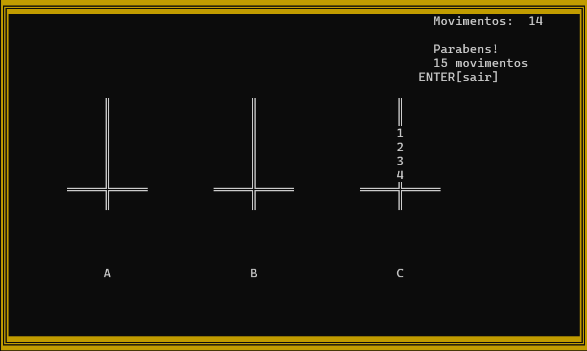

# Torre-de-Hanoi

Projeto desenvolvido durante o terceiro semestre da minha graduação em Sistemas de Informação.

Desenvolvido em C++, o projeto teve como objetivo explorar e fixar alguns conceitos importantes:

- **Introdução a Pilhas**: O jogo de Hanoi consiste basicamente em empilhar discos de tamanhos diferentes, garantindo sempre que um disco de menor tamanho seja colocado em outro. Com isso, a introdução da utilização de pilhas se encaixa muito bem na aplicação.

- **Tipo Abstrato de Dado (TAD)**: Utilização de funções da pilha de um arquivo a parte.

- **Modularização do algoritmo**: Hoje, após alguns anos de estudo, consigo identificar inúmeros pontos do código que poderiam ser melhorados. Isso é algo natural com a experiência. No entanto, na época, desenvolver esse programa foi crucial para entender na prática a importância da modularização.

- **Lógica de Programação**: Todo projeto influencia diretamente no desenvolvimento da lógica de programação. Resolver problemas da melhor forma possível e reconhecer oportunidades de melhoria são habilidades fundamentais que foram trabalhadas nesse projeto.

- **Biblioteca CONIO2**: Utilizei a biblioteca CONIO2 para o desenvolvimento visual do sistema. Foi muito interessante trabalhar pixel por pixel e desenvolver as telas para cada etapa do algoritmo.

---

### **Em geral:**
Foi uma atividade bem bacana de desenvolver, colocar em prática os conhecimentos de pilha foi muito enriquecedor.

Neste projeto em específico não utilizei uma pilha simples, e sim uma pilha múltipla, sendo um conceito mais complexo de se aplicar, deixei um registro feito no paint na época para melhor entendimento (última imagem do respositório).

---

### **Como jogar o game Torre de Hanoi:**

O game consiste basicamente em montar novamente a torre em outro disco (sem ser no que ja vem montado), com o mínimo de movimentos que conseguir, levando em consideração que um disco maior não pode sobrepor um menor NUNCA.

Para movimentar os discos, basta clicar nas teclas respectivas de cada Torre (A, B ou C) de origem, em seguida, de destino.
(Exemplo: quero movimentar um disco da torre A para a torre C, basta clicar A, depois clicar C).

---

### **Como rodar:**
1. Siga as instruções do repositório a seguir [Tutorial IDE](https://github.com/mateus-sm/Conio2-VsCode) para utilizar o VSCODE como IDE C / C++ (Copilar o arquivo). Tal repositório ja inclui a biblioteca do CONIO2 que é utilizada no projeto, caso opte por outra IDE de C / C++, certifique-se de incluí-la.
2. Adicione o arquivo `TadPilhasMultiplas2.h` no mesmo repositório do programa principal `Torre Hanoi.cpp`.
3. execute o programa `Torre Hanoi.cpp`.

---

